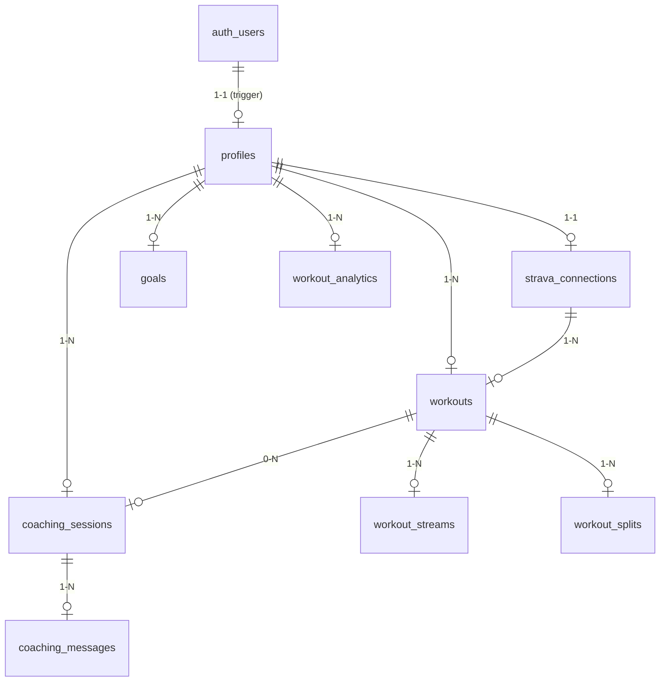
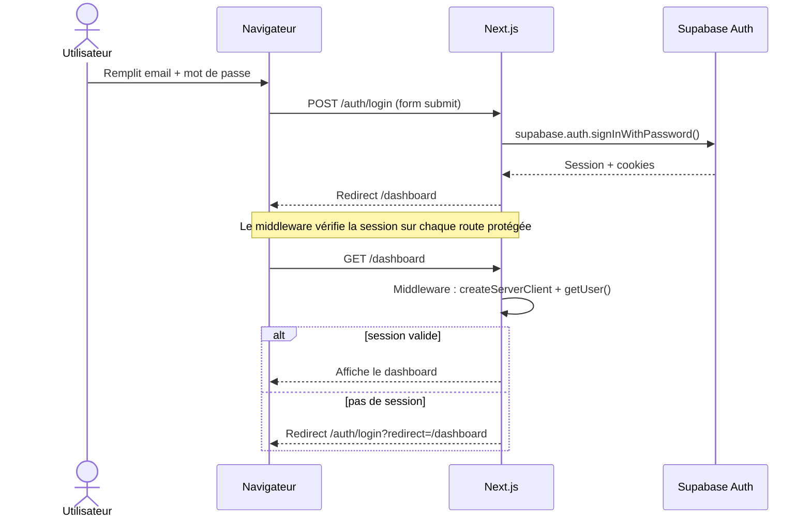
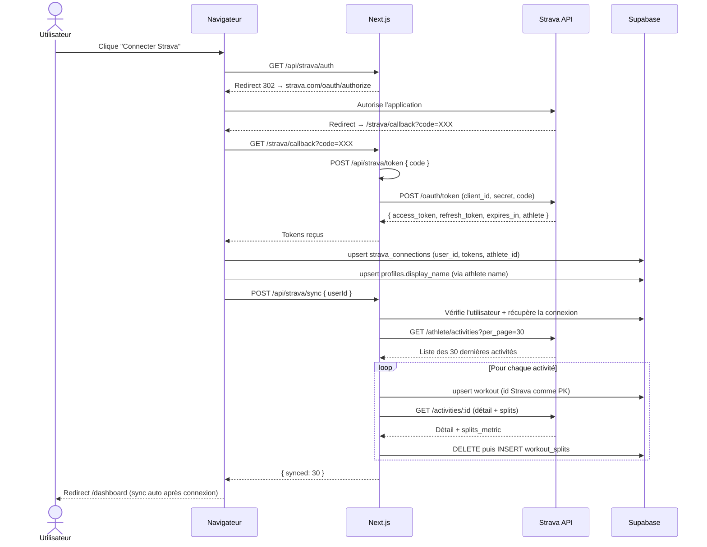
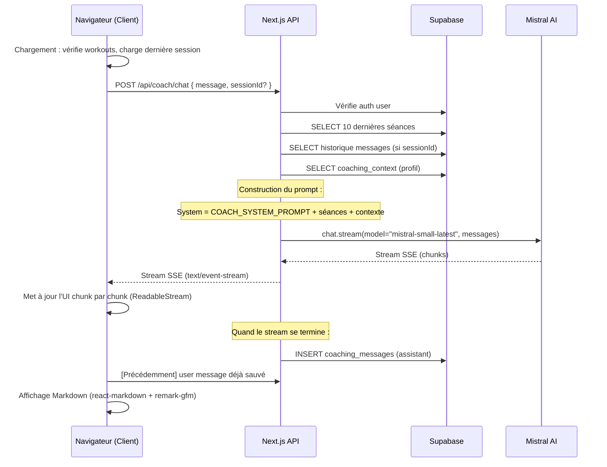

# Documentation Technique — Forme

> **Version :** 0.1.0 — **Date :** 12 juin 2026

---

## Table des matières

- [Stack technique](#stack-technique)
- [Structure du projet](#structure-du-projet)
- [Schéma de la base de données](#schéma-de-la-base-de-données)
- [Flux d'authentification](#flux-dauthentification)
- [Flux Strava OAuth + Sync](#flux-strava-oauth--sync)
- [Architecture du Coach IA](#architecture-du-coach-ia)
- [Déploiement](#déploiement)
- [Développement local](#développement-local)

---

## Stack technique

| Couche | Technologie | Version |
|---|---|---|
| Framework | Next.js | 16.2.9 |
| Langage | TypeScript | ~5.x |
| Base de données | Supabase (PostgreSQL) | 17 |
| Auth | Supabase Auth (SSR) | — |
| ORM / Client DB | `@supabase/supabase-js` + `@supabase/ssr` | 2.x / 0.12.x |
| IA | Mistral AI (`@mistralai/mistralai`) | 2.2.5 |
| Styles | Tailwind CSS | v4 |
| Composants UI | lucide-react (icons) | 1.17.x |
| Graphiques | Recharts | 3.8.x |
| Markdown | react-markdown + remark-gfm | 10.1.x / 4.0.x |
| Toast | sonner | 2.0.x |
| Thème | next-themes | 0.4.x |
| Utilitaires CSS | clsx + tailwind-merge | — |
| Typographie | `@tailwindcss/typography` | 0.5.x |
| Police | Inter (via next/font) | — |
| Déploiement | Vercel | — |

---

## Structure du projet

```
forme/
├── .env.local                          # Variables d'environnement locales
├── .gitignore
├── next.config.ts                      # Configuration Next.js
├── package.json                        # Dépendances et scripts
├── tsconfig.json
├── postcss.config.mjs
├── eslint.config.mjs
├── README.md
│
├── public/                             # Assets statiques
│
├── supabase/
│   ├── config.toml                     # Configuration Supabase locale
│   └── migrations/
│       ├── 20260611135622_initial_schema.sql   # Schéma initial
│       └── 20260612000001_fix_schema.sql       # Ajustements (coaching_context, splits)
│
└── src/
    ├── middleware.ts                   # Protection des routes authentifiées
    │
    ├── app/
    │   ├── layout.tsx                  # Root layout (ThemeProvider, AppHeader, Toaster)
    │   ├── page.tsx                    # Landing page publique
    │   ├── globals.css                 # Styles Tailwind v4 + classes utilitaires
    │   │
    │   ├── auth/
    │   │   ├── login/page.tsx          # Connexion email/mot de passe
    │   │   └── signup/page.tsx         # Inscription email/mot de passe
    │   │
    │   ├── dashboard/page.tsx          # Tableau de bord (résumé, sync, coach)
    │   │
    │   ├── workouts/
    │   │   ├── page.tsx                # Liste des séances
    │   │   └── [id]/page.tsx           # Détail d'une séance + splits
    │   │
    │   ├── stats/
    │   │   ├── page.tsx                # Statistiques globales
    │   │   └── monthly-chart.tsx       # Graphique barres Recharts (client)
    │   │
    │   ├── coach/page.tsx              # Chat Coach IA (client, streaming SSE)
    │   │
    │   ├── settings/page.tsx           # Réglages (profil, connexions, contexte coach)
    │   │
    │   ├── strava/
    │   │   └── callback/page.tsx       # Callback OAuth Strava (client)
    │   │
    │   └── api/
    │       ├── strava/
    │       │   ├── auth/route.ts       # Redirection vers OAuth Strava
    │       │   ├── token/route.ts      # Échange code → tokens
    │       │   └── sync/route.ts       # Sync activités + splits
    │       ├── coach/
    │       │   └── chat/route.ts       # Chat streaming Mistral AI
    │       └── profile/
    │           └── context/route.ts    # GET/POST coaching context
    │
    ├── components/
    │   ├── layout/
    │   │   └── app-header.tsx          # Navigation principale (client)
    │   ├── ui/
    │   │   └── theme-toggle.tsx         # Bouton dark/light mode
    │   ├── sync-button.tsx             # Bouton de synchronisation Strava
    │   └── coach-context-editor.tsx    # Éditeur du contexte coach
    │
    └── lib/
        ├── supabase/
        │   ├── client.ts              # Client Supabase (navigateur)
        │   └── server.ts              # Client Supabase (serveur, SSR cookies)
        ├── ai/
        │   └── client.ts              # Client Mistral + system prompt
        ├── utils/
        │   └── cn.ts                  # Utilitaire clsx + tailwind-merge
        └── strava/                     # (réservé / vide)
```

---

## Schéma de la base de données

### Relations entre tables



### Tables détaillées

#### `profiles`
Étend `auth.users` avec les données utilisateur.

| Champ | Type | Description |
|---|---|---|
| `id` | `uuid PK` | Référence `auth.users.id` (CASCADE) |
| `display_name` | `text` | Nom affiché (issu Strava ou manuel) |
| `avatar_url` | `text` | URL avatar |
| `goal_description` | `text` | Description d'objectif |
| `sport_type` | `text[]` | Types de sport pratiqués |
| `coaching_context` | `text` | Contexte persistant pour le coach IA (ajouté en v2) |
| `created_at` | `timestamptz` | Date création |
| `updated_at` | `timestamptz` | Date modification |

Créé automatiquement via un trigger `on_auth_user_created` sur `auth.users`.

#### `strava_connections`
Stocke les tokens OAuth Strava de chaque utilisateur.

| Champ | Type | Description |
|---|---|---|
| `id` | `uuid PK` | |
| `user_id` | `uuid FK → profiles` | Unique par utilisateur |
| `strava_athlete_id` | `bigint` | ID Strava de l'athlète |
| `access_token` | `text` | Token d'accès Strava |
| `refresh_token` | `text` | Token de refresh Strava |
| `expires_at` | `timestamptz` | Date d'expiration du token |
| `created_at` / `updated_at` | `timestamptz` | |

#### `workouts`
Activités synchronisées depuis Strava. La clé primaire est l'ID Strava.

| Champ | Type | Description |
|---|---|---|
| `id` | `bigint PK` | ID Strava de l'activité |
| `user_id` | `uuid FK → profiles` | Propriétaire |
| `strava_connection_id` | `uuid FK → strava_connections` | Connexion source |
| `name` | `text` | Nom de l'activité |
| `sport_type` | `text` | Run, TrailRun, Ride, Swim, etc. |
| `workout_type` | `text` | Sous-type d'entraînement |
| `description` | `text` | Description |
| `distance_meters` | `float` | Distance en mètres |
| `moving_time_seconds` | `int` | Temps de mouvement |
| `elapsed_time_seconds` | `int` | Temps écoulé |
| `total_elevation_gain` | `float` | Dénivelé positif total |
| `average_speed` | `float` | Vitesse moyenne (m/s) |
| `max_speed` | `float` | Vitesse max (m/s) |
| `average_heartrate` | `float` | FC moyenne (bpm) |
| `max_heartrate` | `float` | FC max (bpm) |
| `average_cadence` | `float` | Cadence moyenne (spm) |
| `average_watts` | `float` | Puissance moyenne (W) |
| `max_watts` | `float` | Puissance max (W) |
| `kilojoules` | `float` | Énergie totale (kJ) |
| `calories` | `float` | Calories (kcal) |
| `perceived_exertion` | `int` | Effort perçu (RPE) |
| `start_date` | `timestamptz` | Date/heure de début |
| `timezone` | `text` | Fuseau horaire |
| `polyline` | `text` | Polyline détaillée |
| `map_summary_polyline` | `text` | Polyline simplifiée |
| `device_name` | `text` | Appareil utilisé |
| `gear_id` | `text` | ID équipement |
| `is_manual` | `boolean` | Saisie manuelle |
| `trainer` | `boolean` | Home trainer |
| `commute` | `boolean` | Trajet domicile-travail |
| `flagged` | `boolean` | Flaggué |
| `private_note` | `text` | Note privée |
| `weather_temp` / `humidity` / `wind_speed` / `description` | `float` / `text` | Météo |
| `raw_json` | `jsonb` | Payload brut Strava |
| `created_at` / `updated_at` | `timestamptz` | |

Index : `(user_id, start_date desc)`, `(user_id, sport_type)`.

#### `workout_streams`
Données temporelles brutes (FC, cadence, altitude, etc.).

| Champ | Type | Description |
|---|---|---|
| `id` | `uuid PK` | |
| `workout_id` | `bigint FK → workouts` | CASCADE |
| `stream_type` | `text` | `heartrate`, `cadence`, `velocity`, `altitude`, etc. |
| `data` | `jsonb` | Tableau de valeurs |
| `series_type` | `text` | `distance` ou `time` |
| `original_size` | `int` | Nombre de points |
| `resolution` | `text` | `low`, `medium`, `high` |

#### `workout_splits`
Découpage kilométrique des activités.

| Champ | Type | Description |
|---|---|---|
| `id` | `uuid PK` | |
| `workout_id` | `bigint FK → workouts` | CASCADE |
| `split` | `int` | Numéro du kilomètre |
| `distance_meters` | `float` | Distance du split |
| `moving_time_seconds` | `int` | Temps |
| `average_speed` | `float` | Vitesse moyenne |
| `average_heartrate` | `float` | FC moyenne |
| `elevation_difference` | `float` | Dénivelé |
| `pace_seconds` | `float` | Allure (s/km) |

#### `goals`
Objectifs définis par l'utilisateur.

| Champ | Type | Description |
|---|---|---|
| `id` | `uuid PK` | |
| `user_id` | `uuid FK → profiles` | CASCADE |
| `title` | `text` | Titre |
| `description` | `text` | Description |
| `sport_type` | `text` | Type de sport |
| `target_type` | `text` | `distance`, `time`, `frequency`, `pace`, `heart_rate`, `elevation`, `custom` |
| `target_value` | `float` | Valeur cible |
| `target_unit` | `text` | Unité |
| `current_value` | `float` | Valeur actuelle |
| `start_date` / `target_date` | `date` | Période |
| `status` | `text` | `active`, `completed`, `archived` |

#### `coaching_sessions`
Sessions de conversation avec le coach IA.

| Champ | Type | Description |
|---|---|---|
| `id` | `uuid PK` | |
| `user_id` | `uuid FK → profiles` | CASCADE |
| `title` | `text` | Titre de la session |
| `summary` | `text` | Résumé |
| `workout_id` | `bigint FK → workouts` | Session liée à une séance (optionnel, SET NULL) |
| `created_at` | `timestamptz` | |

#### `coaching_messages`
Messages individuels dans une session de coaching.

| Champ | Type | Description |
|---|---|---|
| `id` | `uuid PK` | |
| `session_id` | `uuid FK → coaching_sessions` | CASCADE |
| `role` | `text` | `user`, `assistant`, `system` |
| `content` | `text` | Contenu du message |
| `metadata` | `jsonb` | Métadonnées (optionnel) |
| `created_at` | `timestamptz` | |

#### `workout_analytics`
Cache de données analytiques pré-calculées.

| Champ | Type | Description |
|---|---|---|
| `id` | `uuid PK` | |
| `user_id` | `uuid FK → profiles` | |
| `period` | `text` | `week`, `month`, `year`, `all` — unique par user |
| `data` | `jsonb` | Données agrégées |
| `computed_at` | `timestamptz` | |

---

## Flux d'authentification

Forme utilise **Supabase Auth** avec le SSR (`@supabase/ssr`) pour gérer l'authentification par email/mot de passe.



**Protection des routes** : le middleware (`src/middleware.ts`) vérifie la session pour `/dashboard`, `/workouts`, `/coach`, `/settings`, `/stats`. Les routes `/auth/*` et `/strava/*` sont publiques.

**Création de profil** : via un trigger PostgreSQL `on_auth_user_created` qui insère automatiquement une ligne dans `profiles` après chaque inscription.

---

## Flux Strava OAuth + Sync



**Détails importants :**
- Le refresh token Strava est géré automatiquement dans `/api/strava/sync` : si `expires_at` est dépassé, un nouveau token est demandé avant d'appeler l'API.
- Le client `supabaseAdmin` (service_role) est utilisé pour les écritures dans sync et context, car le cookie SSR ne permet pas de setter les cookies dans un contexte API Route.
- Les activités sont upsertées sur conflit `id` (idem Strava), ce qui rend la sync idempotente.

---

## Architecture du Coach IA



**Composition du system prompt** :

```
Tu es Forme Coach, un coach sportif IA expert en analyse d'entraînement.
[...]
Parle en français, de façon concise et motivante.
Base tes conseils sur les données fournies.
Donne des conseils concrets et actionnables.
[Si tendances identifiées, signale-les.]

Séances récentes de l'utilisateur :
- 12/06/2026: Sortie longue (Run), 15.2km, 78min, FC 152bpm, D+120m
- 10/06/2026: Fractionné (Run), 8.5km, 42min, FC 165bpm
[...]

Contexte historique des conversations avec l'utilisateur :
[coaching_context saisi par l'utilisateur dans /settings]
```

**Détails techniques :**
- Modèle utilisé : `mistral-small-latest`
- Streaming : SSE via `ReadableStream` et `TextEncoder`
- Sauvegarde des messages : à la volée côté serveur (user à l'envoi, assistant après stream)
- La session est créée automatiquement si `sessionId` est absent
- Le `X-Session-Id` header permet au client de connaître l'ID de session
- Historique conservé et rechargé pour continuité de la conversation

---

## Déploiement

Le projet est déployé sur **Vercel** (projet lié : `forme`, team `prJ_LUI7VaESLwgZLD9Di2daqi`).

### Variables d'environnement requises

| Variable | Description | Source |
|---|---|---|
| `NEXT_PUBLIC_SUPABASE_URL` | URL du projet Supabase | Tableau de bord Supabase > Settings > API |
| `NEXT_PUBLIC_SUPABASE_ANON_KEY` | Clé anon (publique) | Supabase > Settings > API |
| `SUPABASE_SERVICE_ROLE_KEY` | Clé service_role (privée) | Supabase > Settings > API |
| `MISTRAL_API_KEY` | Clé API Mistral | console.mistral.ai |
| `STRAVA_CLIENT_ID` | ID application Strava | strava.com/settings/api |
| `STRAVA_CLIENT_SECRET` | Secret application Strava | strava.com/settings/api |
| `NEXT_PUBLIC_SITE_URL` | URL du site (ex: `https://forme.vercel.app`) | — |

### Déploiement Vercel

```bash
# Installation CLI Vercel
npx vercel link

# Déploiement production
npx vercel --prod

# Ou via GitHub : push sur main → auto-deploy
```

---

## Développement local

### Prérequis

- Node.js ≥ 20
- npm
- Un projet Supabase (local ou cloud)
- Des comptes développeur Strava et Mistral AI

### Étapes

```bash
# 1. Cloner le dépôt
git clone git@github.com:othevet/forme.git
cd forme

# 2. Installer les dépendances
npm install

# 3. Copier le fichier d'environnement
cp .env.local.example .env.local
# Éditer .env.local avec vos clés

# 4. Démarrer Supabase local (optionnel)
npx supabase start
npx supabase migration up

# 5. Lancer le serveur de développement
npm run dev
# → http://localhost:3001

# 6. Linter
npm run lint
```

### Structure des migrations Supabase

```bash
supabase/migrations/
├── 20260611135622_initial_schema.sql   # Tables, RLS, triggers
└── 20260612000001_fix_schema.sql       # coaching_context, workout_splits
```

Appliquer les migrations :

```bash
npx supabase db push
# ou en local :
npx supabase migration up
```
